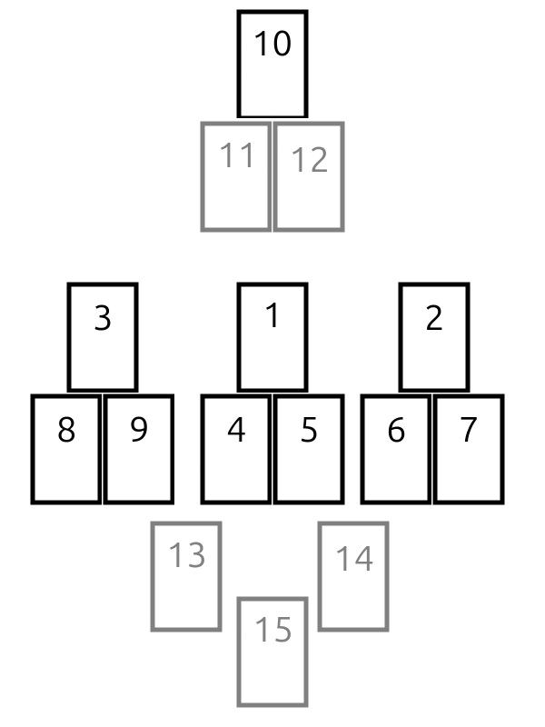

# Eye of Providence

This is what we are calling the "Eye of Providence" spread. It's a tarot spread that features a few interesting aspects which should prove familiar to traveling men.

## Layout

The core cards of this spread are numbered 1-10 and dealt as indicated in the image above. (First card in the center, second spaced to the right, third spaced to the left. Then two cards below and touching the first, two below and touching the second, and two below and touching the third. Last, one card centered above.)

The optional cards are 11-15, and can prove interesting to draw. I find them superfluous when the reading itself proves clear, but when the meaning is murky, they tend to help clarify quite a bit. (The eleventh and twelfth cards are below and touch the 10th card. The thirteenth is spaced below and between 1 and 3, the fourteenth spaced below and between 1 and 2, and the last card is at the bottom center, below and between thirteen and fourteen.)

## Cards 1-10

### Core Premise

The idea of this spread is that the center three cards represent the Self - the subject of the reading and, generally speaking, the questioner/shuffler/requester.

The cards to the right and the left offer two columns you are between. This is to force a false dichotomy, each contrasts with the other. The point of contrast could be anything:
  * Two different but simultaneous situations
  * Two potential outcomes for a decision
  * Two opposing decisions that can be made
  * Two perspectives on a topic
  * Two people (aside from yourself) in a situation you're involved with

The card at the apex represents the Eye of Providence and gives us a clue through which to attune the reading.

The optional five cards at the end have their own significances explained further below.

### Intention

You can set the intention while shuffling to be anything, but I often find myself using this spread as a way for the cards to tell me something I need to hear in this moment or on this particular day. Both approaches work, depending on the day. I find that the Self section really clues you in to what the situation is.

### Card 1 - Self: Primary

This is you, the requester, the shuffler, the questioner, the inimitable subject of the reading. This card represents your current situation or state of mind.

### Card 2 - Right Column: Primary

This is what's on the right, one of our false dichotomy. You can think of this as one Gemini twin, representing one perspective, decision, outcome, or consideration.

### Card 3 - Left Column: Primary

This is what's on the left, the second of our false dichotomy. You can think of this as the other Gemini twin, representing potentially a different perspective, decision, outcome, or consideration.

### Cards 4 and 5 - Self: Support A & B

These two cards serve as clarifiers for the subject. While these can certainly help to clarify the state of mind or situation at hand, I often find that they also demonstrate a linkage to our Right and Left columns. Perhaps these cards show excitement and hesitation, and one is connected to an opporunity represented by the Right Column, and the other is connected to a decision that needs to be made represted by the Left. You may need to switch these cards around if there is an obvious link in theme, or there's an adjacent card present in one of the columns.

Also helpful is noticing any unbalanced representation - more Pentacles/Coins/Discs overall in the spread, or Swords being the only suit not present in the spread. These can guide us into understanding the situation at hand better.

### Cards 6 and 7 - Right: Support A & B

These two cards serve as clarifiers for the Right Column. They should represent attitudes or considerations to whatever that column is representing. I find that when reversed, they can also add context - what happened in the past, or how this will shake out in the future.

### Cards 8 and 9 - Left: Support A & B

Same as for Cards 6 and 7, but for the Left column.

### Card 10 - The Eye of Providence

The titular card of this spread, this card can represent three things: either the lens through which the reading is to be taken, the aspect of this situation that we are not seeing that the reading is providing to us, or the overall outcome.

When it represents a lens, I find it is usually a major arcana card. It tells us that the reading should be viewed in light of whatever subject the card is providing us. It acts as a keystone and helps us to narrow down our focus to one particular viewpoint.

When it represents clarity, it acts as a beam of light in the darkness. In murky situations where things feel muddled and difficult to pick apart, this serves to tell us something that we are obviously missing but is in front of our faces. It shines a light on what you need to see or hear to give you direction in the darkness.

When it represents an outcome, it can be any card but it tends towards the dramatic. It will usually give us an idea of how successful or not we will be, or it will give opportunity for something that serves as a chance for us to grow.

We'll often see some kind of linkage in this card cluing us in to either the Right or Left column. We may see shared imagery, or adjacent numbers in the same suit, or perhaps a card that, when reversed, doubles down on an idea already present by another card.

## Optional Cards

### Cards 11 and 12 - Eye of Providence: Lenses A & B

These cards are great to pull when you're not sure which meaning the Eye represents. Eleven usually serves to gives us context or confirm the reader's intuition on how the Eye is to be interpreted, and Twelve usually dials in the intensity or skew of the meaning.

### Cards 13, 14, and 15: As Above, So Below

Following the Hermetic principle of "As Above, So Below," these three cards serve as a counter point to The Right and Left Columns and the Self. I often find they help towards the end of a reading, and I usually don't draw them up front.

Thirteen, being situation between the Left Column and the Self, represents some foundation or background as it relates to you. Fourteen does the same for the Right Column and Self. For example, a card in this position might give you a clue as why you are feeling the way you are, or how the situation got this far, or what strength or purpose you have that drives you in this particular direction.

Fifteen serves as a counterpoint to the Eye of Providence. We often refer to this as the Grounding Card. It will most often point out your greatest strength or most defining feature as it related to this reading. While the Eye of Providence gives us clarity where we have none, this card reminds us of where we came from, who we are, and helps us orientate ourselves. 

## History

I started with what I learned many years ago as a Tripeaks Spread - 3 horizontally arranged and spaced sets of 3 cards, which themselves are arranged as a triangle or pyramid, edges touching.

The premise is that you can apply any of your standard 3 card spreads (past-present-future, theme-foundation-advice, what-why-whatdoido, etc). Each apex or "peak" is one of these significances. The 2 cards forming the base of each mountain act as clarifying cards that give you some insight into what underlies or supports that peak.

For me, the three significances I chose were PerspectiveA, Self, and PerspectiveB. It essentially forces you to focus on 2 things, great for ADHDers like myself who normally frolic in the many potential paths that lay in front of us.

Eventually, Nick suggested a tenth card, which we pointed out was situated above, called the Eye of Providence - channeling the back of the US Dollar bill, basically.

I often pulled clarifiers for the Eye of Providence, and Nick added two cards that essentially just build those clarifiers into the spread. Nick also toyed with the final three cards being below, and we sort of felt out what their purposes might be.

## Suggestions

All of this is fun to experiment with. Some things to try:

  1. Start by drawing a card to determine in advance what the columns are going to represent:
    * Swords - Decision
    * Rods - Perspectives
    * Coins - Outcomes
    * Cups - Considerations
  1. Change what the three peaks are entirely:
    * Past, Present, and Future
    * Theme, Background Context, Advice
    * What I need to know, why I need to know it, and what do I do about it
    * Problem, Possible Solution, Warning
    * Them, Me, and the Situation
  1. Try adding some connector cards and doing a major arcana only spread
  1. Try using a divination or themed tarot deck for Cards 10, 13, 14, and 15
  1. Try using a divination or themed tarot deck for Cards 2 and 3

###### Credits

Huge shoutout to my Brother, Nick Noble. Check out one of his projects that is heavily related here: [Tarot.sh, a terminal-themed tarot AI that's great for learning cards and spreads](https://tarot.sh)

Love for all the Joshua 890 guys.
